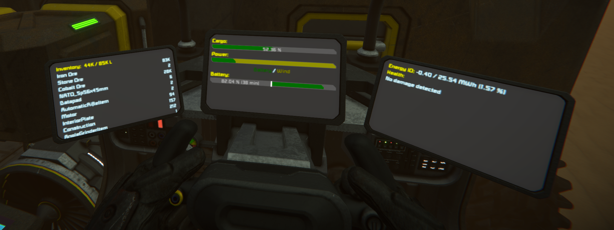

# Space Engineers Ship Status Script





### TOC
- [About](#about)
- [Api listing](#api-listing)
- [Contributing](#contributing)
- [Links](#links)

### About
A configurable ship status display which renders sprites to different surfaces using a very flexible templating engine.

Makes use of the [templating engine](https://github.com/p-mcgowan/se-scripts/tree/master/template) and [graphics lib](https://github.com/p-mcgowan/se-scripts/tree/master/graphics) scripts to draw sprites.

Reads from CustomData, parsing a template and a display target section. Easily allows for customization and extension to render awesome screens.

The templates have some built-in functionality, but you can also build your own rendering methods.

Images generated with ini format CustomData (see [Malware's MDK](https://github.com/malware-dev/MDK-SE/wiki/Handling-configuration-and-storage)):

```ini
; CustomData config:
; the [global] section applies to the whole program, or sets defaults for shared
;
; For surface selection, use 'name <number>' eg: 'Cockpit <1>' - by default, the
; first surface is selected (0)
;
; The output section of the config is the template to render to the screen

[global]
;  global program settings (will overide settings detected in templates)
;  eg if a template has {power.bar}, then power will be enabled unless false here
;airlock=true
;production=false
;cargo=false
;power=false
;health=false
;  airlock config (defaults are shown)
;airlockOpenTime=750
;airlockAllDoors=false
;airlockDoorMatch=Door(.*)
;airlockDoorExclude=Hangar
;  health config (defaults are shown)
;healthIgnore=
;healthOnHud=false

[LCD Panel]
output=
|Jump drives: {power.jumpDrives}
|{power.jumpBar}
|Batteries: {power.batteries}
|{power.batteryBar}
|Reactors: {power.reactors}, Output: {power.reactorOutputMW} MW  ({power.reactorUr} Ur)
|Solar panels: {power.solars}, Output: {power.solarOutputMW} MW
|Wind turbines: {power.turbines}, Output: {power.turbineOutputMW} MW
|H2 Engines: {power.engines}, Output: {power.engineOutputMW} MW
|Energy IO: {power.ioString}
|{power.ioBar}
|
|Ship status: {health.status}
|{health.blocks}
|
|{production.status}
|{production.blocks}
|
|Cargo: {cargo.stored} / {cargo.cap}
|{cargo.bar}
|{cargo.items}
```

### Api listing
This is an example of the options available - the template key `{something}` is followed by the value rendered:


The config used to generate it:
```ini
[Sci-Fi LCD Panel 5x5 2]
output=
|{text:0,60,60:\{text:colour=60,0,60,150:\\{coloured text\\}\}}: {text:colour=60,0,60,150:\{coloured text\}}
|{text:colour=0,60,60:\{cargo.bar\}}:
|{cargo.bar}
|{text:colour=0,60,60:\{cargo.cap\}} => {cargo.cap}
|{text:colour=0,60,60:\{cargo.fullString\}} => {cargo.fullString}
|{text:colour=0,60,60:\{cargo.items\}}:
|{cargo.items}
|{text:colour=0,60,60:\{cargo.stored\}} => {cargo.stored}
|{text:colour=0,60,60:\{health.status\}} => {health.status}
|{text:colour=0,60,60:\{health.blocks\}}:
|{health.blocks}
|{text:colour=0,60,60:\{production.blocks\}}:
|{production.blocks}
|{text:colour=0,60,60:\{production.status\}} => {production.status}
|{text:colour=0,60,60:\{power.ioString\}} => {power.ioString}
|{text:colour=0,60,60:\{power.input\}} => {power.input}
|{text:colour=0,60,60:\{power.output\}} => {power.output}
|{text:colour=0,60,60:\{power.maxOutput\}} => {power.maxOutput}
|{text:colour=0,60,60:\{power.ioBar\}}:
|{power.ioBar}

[Sci-Fi LCD Panel 5x5]
output=
|{text:colour=0,60,60:\{power.jumpBar\}}:
|{power.jumpBar}
|{text:colour=0,60,60:\{power.jumpCurrent\}} => {power.jumpCurrent}
|{text:colour=0,60,60:\{power.jumpDrives\}} => {power.jumpDrives}
|{text:colour=0,60,60:\{power.jumpMax\}} => {power.jumpMax}
|{text:colour=0,60,60:\{power.batteries\}} => {power.batteries}
|{text:colour=0,60,60:\{power.batteryBar\}}: 
|{power.batteryBar}
|{text:colour=0,60,60:\{power.batteryCurrent\}} => {power.batteryCurrent}
|{text:colour=0,60,60:\{power.batteryInput\}} => {power.batteryInput}
|{text:colour=0,60,60:\{power.batteryInputMax\}} => {power.batteryInputMax}
|{text:colour=0,60,60:\{power.batteryMax\}} => {power.batteryMax}
|{text:colour=0,60,60:\{power.batteryOutput\}} => {power.batteryOutput}
|{text:colour=0,60,60:\{power.batteryOutputMax\}} => {power.batteryOutputMax}
|{text:colour=0,60,60:\{power.engineOutputMax\}} => {power.engineOutputMax}
|{text:colour=0,60,60:\{power.engineOutputMW\}} => {power.engineOutputMW}
|{text:colour=0,60,60:\{power.engines\}} => {power.engines}
|{text:colour=0,60,60:\{power.reactorOutputMax\}} => {power.reactorOutputMax}
|{text:colour=0,60,60:\{power.reactorOutputMW\}} => {power.reactorOutputMW}
|{text:colour=0,60,60:\{power.reactors\}} => {power.reactors}
|{text:colour=0,60,60:\{power.reactorString\}} => {power.reactorString}
|{text:colour=0,60,60:\{power.reactors\}} => {power.reactors}
|{text:colour=0,60,60:\{power.reactorUr\}} => {power.reactorUr}
|{text:colour=0,60,60:\{power.solarOutputMax\}} => {power.solarOutputMax}
|{text:colour=0,60,60:\{power.solarOutputMW\}} => {power.solarOutputMW}
|{text:colour=0,60,60:\{power.solars\}} => {power.solars}
|{text:colour=0,60,60:\{power.turbineOutputMax\}} => {power.turbineOutputMax}
|{text:colour=0,60,60:\{power.turbineOutputMW\}} => {power.turbineOutputMW}
|{text:colour=0,60,60:\{power.turbines\}} => {power.turbines}
|{text:colour=0,60,60:\{power.ioBar\}} (inline): {power.ioBar}
```

Global config settings:

setting|value type|description|default
---|---|---|---
airlock|true/false|Toggle program airlock|false
production|true/false|Toggle program production|auto (if in template)
cargo|true/false|Toggle program cargo|auto (if in template)
power|true/false|Toggle program power|auto (if in template)
health|true/false|Toggle program health|auto (if in template)
airlockOpenTime|integer|Set airlock auto-close time (ms)|750
airlockAllDoors|true/false|Toggle auto door closing for non-airlock doors|false
airlockDoorMatch|string|Door pattern to match (regex)|Door(.*)
airlockDoorExclude|string|Door pattern to exclude|Hangar
healthIgnore|string|Pattern to ignore (eg Thrust,Wheel)|none
healthOnHud|true/false|Enable "Show on HUD" for damaged blocks|false
theme|string|Configure all displays to use a theme (see config template var below)|none


The template vars available by default are:
template var|options|description
---|---|---
config| font: set the font <br/>size: set the font size <br/>textPadding: set the padding <br/>colour: set the text colour <br/>bgColour: set the background colour |Configure the display (only runs once)
cargo.bar|none|A coloured fill bar which goes from green to red based on % full
cargo.cap|none|The cargo volume capacity
cargo.fullString|none|A nicely formatted `<current> / <max> L` volume string
cargo.items|none|A list of all items in cargo. Will split into 2 columns if display is wide enough 
cargo.stored|none|Current cargo volume
health.blocks|none|A list of all damaged blocks and their percent health
health.status|none|A message saying whether damage is detected or not
power.batteries|none|Count of batteries
power.batteryBar|[default bar options](https://github.com/p-mcgowan/se-scripts/tree/master/graphics)|Coloured bar showing discharge / recharge rate and time remaining
power.batteryCurrent|none|Total of battery charge (MWh).
power.batteryInput|none|Current battery input (MW).
power.batteryInputMax|none|Max battery input (MW).
power.batteryMax|none|Max battery capacity (MWh).
power.batteryOutput|none|Current battery output (MW).
power.batteryOutputMax|none|Max battery output (MW).
power.engineOutputMax|none|Max H2 engine output (MW).
power.engineOutputMW|none|Current H2 engine output (MW).
power.engines|none|Count of H2 engines
power.ioString|none|Formatted energy IO: net output / max output (utilization %).
power.ioLegend|none|Shows a coloured legend for the io bar.
power.input|none|Current energy input (MW).
power.output|none|Current energy output (MW).
power.maxOutput|none|Max possible energy output (MW).
power.ioBar|none|Bar showing contribution to total power by block. Reactors are blue, H2 engines red, betteries green, turbines yellow, solars cyan. If blocks are disabled, they are shown in a darker colour.
power.jumpBar|[default bar options](https://github.com/p-mcgowan/se-scripts/tree/master/graphics), text: string, pct: float|Jump drive charge status. Text and percent override the default bar contents.
power.jumpCurrent|none|Jump drive current charge (MW).
power.jumpDrives|none|Jump drive count.
power.jumpMax|none|Jump drive max charge (MW).
power.reactorOutputMax|none|Reactor max output (MW).
power.reactorOutputMW|none|Reactor current output (MW).
power.reactors|none|Reactor count.
power.reactorString|text: string|Formatted reactor string: &lt;text or Reactors: >&lt;count>, Output: &lt;output> MW, Ur: &lt;uranium> kg"
power.reactors|none|Reactor count
power.reactorUr|none|Reactor uranium in kg.
power.solarOutputMax|none|Max solar output.
power.solarOutputMW|none|Current solar output.
power.solars|none|Solar panel count.
power.turbineOutputMax|none|Max wind turbine output.
power.turbineOutputMW|none|Current wind turbine output.
power.turbines|none|Wind turbine count.
production.blocks|none|List of assemblers and refineries, with a status icon and their queue (if any).
production.status|none|Overall production status (power saving, enabled, halted). The production class will turn on / off production blocks if they idle for a long time, then check every 4 minutes to see if they need to start up again.

You can also register any render method you want, and use any of the values in each of the status programs (Cargo, Production, etc..).

Also available from the [templating script](https://github.com/p-mcgowan/se-scripts/tree/master/template):  
config  
bar  
circle  
midBar  
multiBar  
text  
textCircle  


### Contributing
Feedback, suggestions, comments, criticisms, and bug reports are all welcome and encouraged! Open an issue if you want, I'll try to keep an eye on it.

### Links
[steam workshop](https://steamcommunity.com/sharedfiles/filedetails/?id=2314209066)  
[template engine (github)](https://github.com/p-mcgowan/se-scripts/tree/master/template)  
[template engine (workshop)](https://steamcommunity.com/sharedfiles/filedetails/?id=2314207999)  
[graphics (github)](https://github.com/p-mcgowan/se-scripts/tree/master/graphics)  
[graphics (workshop)](https://steamcommunity.com/sharedfiles/filedetails/?id=2314207214)  
