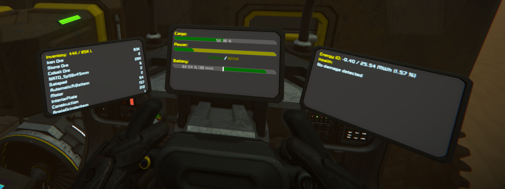
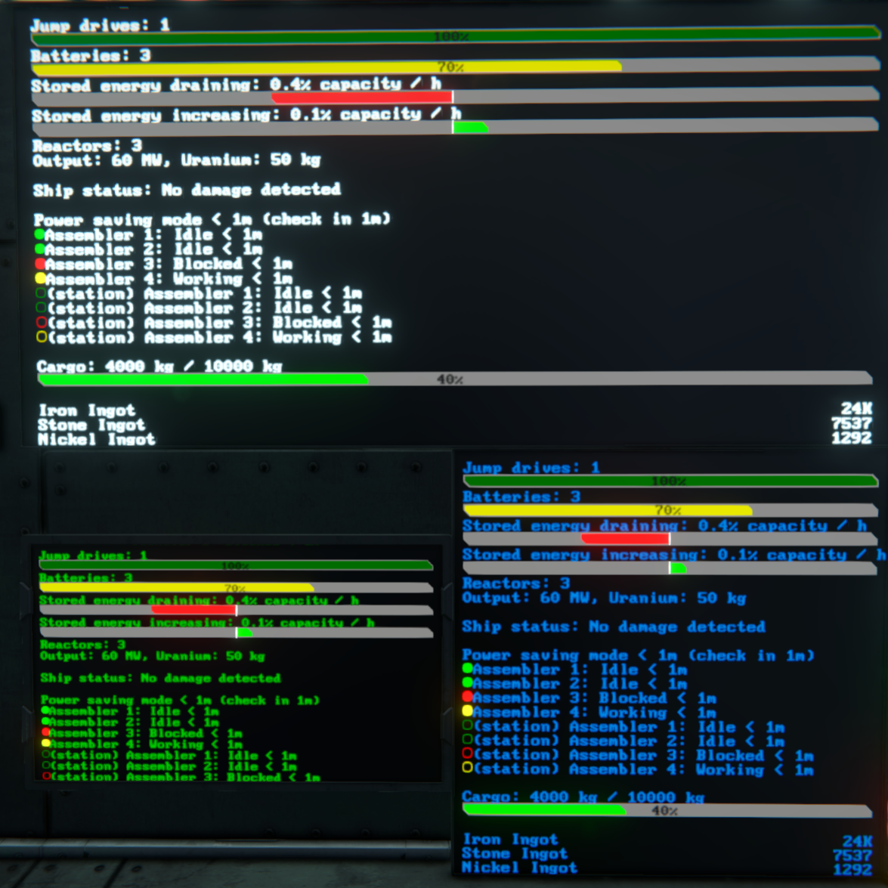
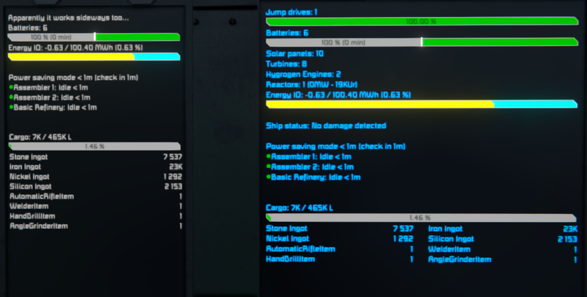

# Space Engineers Sprite Graphics Library





### TOC
- [About](#about)
- [Usage](#usage)
- [Api listing](#api-listing)
- [Contributing](#contributing)
- [Links](#links)

### About
Add some helper methods to make drawing sprites easier using an intuitive API.

### Usage

The second image above was generated using:
```cs
var surface = GridTerminalSystem.GetBlockWithName("LCD Panel").GetSurface(0);
var ds = new DrawingSurface(surface, this, "LCD Panel <0>");

float battCap = 1000f;
float battStored = 100f;

ds
    .Text("Jump drives: 1 ").Newline()
    .Bar(1f, text: "100%").Newline()
    .Text("Batteries: 3   ").Newline()
    .Bar(0.7f, text: "70%").Newline()
    .Text($"Stored energy draining: {Decimal.Round((decimal)Math.Abs(-43f / battStored), 1)}% capacity / h").Newline()
    .MidBar(-43f, battStored, battCap - battStored).Newline()
    .Text($"Stored energy increasing: {Decimal.Round((decimal)(76f / (battCap - battStored)), 1)}% capacity / h").Newline()
    .MidBar(76f, battStored, battCap - battStored).Newline()
    .Text("Reactors: 3").Newline()
    .Text("Output: 60 MW, Uranium: 50 kg").Newline()
    .Newline()
    .Text("Ship status: No damage detected").Newline()
    .Newline()
    .Text("Power saving mode < 1m (check in 1m)").Newline()
    .TextCircle(Color.Green).Text("Assembler 1: Idle < 1m").Newline()
    .TextCircle(Color.Green).Text("Assembler 2: Idle < 1m").Newline()
    .TextCircle(Color.Red).Text("Assembler 3: Blocked < 1m").Newline()
    .TextCircle(Color.Yellow).Text("Assembler 4: Working < 1m").Newline()
    .TextCircle(Color.Green, true).Text("(station) Assembler 1: Idle < 1m").Newline()
    .TextCircle(Color.Green, true).Text("(station) Assembler 2: Idle < 1m").Newline()
    .TextCircle(Color.Red, true).Text("(station) Assembler 3: Blocked < 1m").Newline()
    .TextCircle(Color.Yellow, true).Text("(station) Assembler 4: Working < 1m").Newline()
    .Newline()
    .Text("Cargo: 4000 kg / 10000 kg").Newline()
    .Bar(0.4f, text: "40%", fillColour: Color.Green).Newline()
    .Newline()
    .Text("Iron Ingot").SetCursor(ds.width, null).Text("24K", textAlignment: TextAlignment.RIGHT).Newline()
    .Text("Stone Ingot").SetCursor(ds.width, null).Text("7537", textAlignment: TextAlignment.RIGHT).Newline()
    .Text("Nickel Ingot").SetCursor(ds.width, null).Text("1292", textAlignment: TextAlignment.RIGHT).Newline()
    .Text("Silicon Ingot").SetCursor(ds.width, null).Text("2153", textAlignment: TextAlignment.RIGHT).Newline()
    .Text("AutomaticRifleItem").SetCursor(ds.width, null).Text("1", textAlignment: TextAlignment.RIGHT).Newline()
    .Text("WelderItem").SetCursor(ds.width, null).Text("1", textAlignment: TextAlignment.RIGHT).Newline()
    .Text("HandDrillItem").SetCursor(ds.width, null).Text("1", textAlignment: TextAlignment.RIGHT).Newline()
    .Text("AngleGrinderItem").SetCursor(ds.width, null).Text("1", textAlignment: TextAlignment.RIGHT).Newline()
    .Text("Ice").SetCursor(ds.width, null).Text("1M", textAlignment: TextAlignment.RIGHT).Newline()
    .Draw();
```

### Api listing


```
Draw()
  dispose the frame and render content - if this is not called, nothing will be drawn

SaveCursor()
  store the current cursor position (for reference later)

SetCursor(float? x, float? y)
  move the cursor to x, y

Newline(bool resetX = true)
  move the cursor down by the height of the current font size
  if reset is false, will not set cursor X to 0 (to the left)

Size(float? size = null)
  change font size

Text(
  string text,
  Color? colour = null,
  TextAlignment textAlignment = TextAlignment.LEFT,
  float scale = 1f,
  Vector2? position = null
)
  write the string <text> to the screen. Optionally, coloured, alligned, scaled, or at a certain position

MidBar(
  float net,
  float low,
  float high,
  float width = 0f,
  float height = 0f,
  float pad = 0.1f,
  Color? bgColour = null,
  string text = null,
  Color? textColour = null
)
  using a signed <net> value, show a bar left or right of the midpoint, proportial to low and high

Bar(
  float pct,
  float width = 0f,
  float height = 0f,
  Color? fillColour = null,
  Vector2? position = null,
  string text = null,
  Color? textColour = null,
  Color? bgColour = null,
  TextAlignment textAlignment = TextAlignment.LEFT,
  float pad = 0.1f
)
  draw a progress bar, filled to pct

MultiBar(
  List<float> values,
  List<Color> colours,
  float width = 0f,
  float height = 0f,
  Vector2? position = null,
  string text = null,
  Color? textColour = null,
  Color? bgColour = null,
  TextAlignment textAlignment = TextAlignment.CENTER,
  float pad = 0.1f
)
  Show multiple bar colours in 1 bar. Values should be in percents (eg, 0.1, 0.3, 0.2), and the list of colours will fill in that order.

TextCircle(Color colour, bool outline = false)
  draw a small circle inline with text

Circle(float size, Color colour, Vector2? position = null, bool outline = false)
  draw a circle of varying size
```

See the [links section](#links) for more in-depth usage examples

### Contributing
Feedback, suggestions, comments, criticisms, and bug reports are all welcome and encouraged! Open an issue if you want, I'll try to keep an eye on it.

### Links
[steam workshop](https://steamcommunity.com/sharedfiles/filedetails/?id=2314207214)  
[template engine (github)](https://github.com/p-mcgowan/se-scripts/tree/master/template)  
[template engine (workshop)](https://steamcommunity.com/sharedfiles/filedetails/?id=2314207999)  
[ship status example (github)](https://github.com/p-mcgowan/se-scripts/tree/master/ShipStatus)  
[ship status example (workshop)](https://steamcommunity.com/sharedfiles/filedetails/?id=2314209066)  
