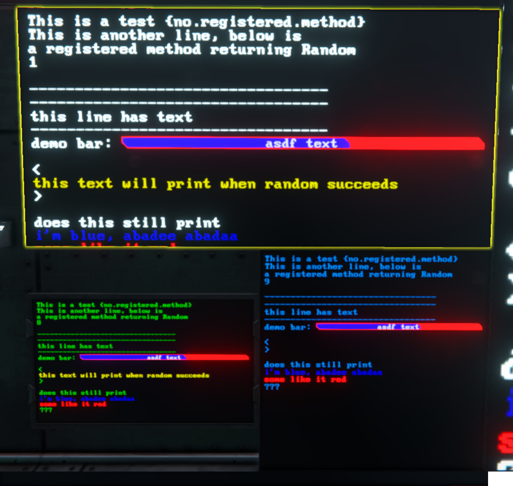
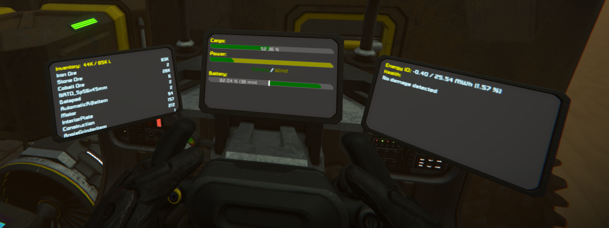

# Space Engineers Template Engine




### TOC
- [About](#about)
- [Usage](#usage)
- [Api listing](#api-listing)
- [Contributing](#contributing)
- [Links](#links)

### About
A basic templating engine which allows you to register callbacks, and replace templates with data on the fly.

Makes use of the [graphics lib](https://github.com/p-mcgowan/se-scripts/tree/master/graphics) script to draw sprites.


### Usage


The Main function shows a basic demo template, and how to register handlers.
The engine has a few built in methods such as text, bar, circle, and a few others.

The basic template variable pattern looks like:
```
{some-keyword-here}
```

Which will call the method registered to the keyword "some-keyword-here". For example, `{text::This is my message}` will write text to the screen

The full variable pattern is as follows:
```
{?<name>:<options>:<text>}
```

The leading "?" will disable the automatic newline the engine inserts (good for hiding empty lines).  
`<name>` is the name of a registered method  
`<options>` is a list of key=value pairs separated by semicolons (;), which is passed to the callback in a dictionary  
`<text>` is any raw text to be rendered. Note that above we used `{text:: <- double colon here }` to tell the engine that no options were provided. Most render functions will accept raw text or `text=something` as an option - both do the same thing.

Using the example below:

```
This is a test {no.registered.method}
This is another line, below is
a registered method returning Random
{test.random:min=0;max=10}

---------------------------------
{?test.spacing}
---------------------------------
{text::this line has text}
---------------------------------
demo bar: {bar:bgColour=red;textColour=100,100,100;fillColour=blue;pct=0.63:asdf text}

<
{?test.cdtnl:c=dimyellow:this text will print when random succeeds}
>

{text:colour=0,0,100:i'm blue, abadee abadaa}
{text:colour=red:some like it red}
```

The template will render the image above (all in the Main demo method).

If you want to show literal brace characters `{` or `}`, escape them with a backslash:
```cs
string tpl = "look at these cool squigglies \{\}";
// also nested
string tpl = "battery count: \{{tpl.battery}\}";
// more complicated
string tpl = "if you type this: {text:0,60,60:\{text:colour=60,0,60,150:\\{coloured text\\}\}}, you get this: {text:colour=60,0,60,150:\{coloured text\}}";
```

### Api listing

The template includes these built in methods:

Template var name|Options|Description
---|---|---
config| font: set the font <br/>size: set the font size <br/>textPadding: set the padding <br/>colour: set the text colour <br/>bgColour: set the background colour |Configure the display (only runs once)
text|text: string of text  <br/>colour: &lt;colour argument> (see below)  <br/>textAlignment: "center", "left", "right"  <br/>scale: a numeric scale factor|basic text rendering
right|none|Set the alignment to the right for the rest of the line
textCircle|colour: &lt;colour argument><br/>outline: if true, will not fill the circle|a small circle inline with text
circle| size: numeric size in pixels<br/>colour: &lt;colour argument><br/>outline: if true, will not fill the circle|a basic circle shape
bar| pct: percent value from 0 to 1 (eg 0.24)<br/>width: width in pixels (default to width of screen or space left on line)<br/>height: height in pixels (defaults to text height)<br/>fillColour: &lt;colour argument><br/>text: string of text<br/>textColour: &lt;colour argument><br/>bgColour: &lt;colour argument><br/>textAlignment: "center", "left", "right"<br/>pad: percentage padding (defaults to 0.1)|a percent bar
midBar| net: plus or minus number<br/>low: positive lowest value (will be used with net / low)<br/>high: positive highest value (will be used with net / high)<br/>width: width in pixels (default to width of screen or space left on line)<br/>height: height in pixels (defaults to text height)<br/>pad: percentage padding (defaults to 0.1)<br/>bgColour: &lt;colour argument> |a bar which accepts low, high, and a signed value, where negative will show red and positive will show green
multiBar|values: a list of floats, separated by underscores (eg `0.1_0.4_0.2`) <br/>colours: a list of &lt;colour argument>, separated by underscores (eg `red_yellow_0,0,0,0.5`) <br/>width: width in pixels (default to width of screen or space left on line) <br/>height: height in pixels (defaults to text height) <br/>text: text content <br/>textColour: &lt;colour argument>, <br/>bgColour: &lt;colour argument>, <br/>|Similar to bar, but showing multiple levels of colours
saveCursor|none|Save the current cusor position
setCursor|x: the x position, y: the y position|If the position is "x" or "y", sets to the saved cursor.<br/>If the position is a percent (eg `50%`), set to percent of width or height.<br/>If position starts with "+" or "-" (eg "+6"), add or subtract that number of characters from the current position.<br/>If position is a number (eg "250.5"), set to that pixel value<br/>If either position is not provided, the current value is unchanged.<br/>

&lt;colour argument>:  Either a string colour name, or RGB or RGBA values

eg: "red", "255,0,0,200"

supported colour names:

black blue brown cyan dimgray gray green orange pink purple red tan transparent white yellow dimgreen dimyellow dimorange dimred

Example template string (see main.cs):
```cs
string templateStrings = 
@"This is a test {no.registered.method}
This is another line, below is
a registered method returning Random
{test.random:min=0;max=10}

---------------------------------
{?test.spacing}
---------------------------------
{text::this line has text}
---------------------------------
demo bar: {bar:bgColour=red;textColour=100,100,100;fillColour=blue;pct=0.63:asdf text}

<
{?test.cdtnl:c=dimyellow:this text will print when random succeeds}
>

does this still print
{text:colour=0,0,100:i'm blue, abadee abadaa}
{text:colour=red:some like it red}
???",
```

The Template engine has a [few built in methods](#api-listing), but you can build any render function and register it so that it is called when the screen renders:

```cs
string template = 
@"this will print hello world
{hello.world}
this will show a bar at 50%
{whoah.dood:pct=0.5}
this will print Not cool man!
{whoah.dood:whoah=dood}
"

// will print "Hello world!" every time a template contains {hello.world}
public void MySimpleTemplateRender() {
    return "Hello world!"
}

// will print "Not cool man!" or draw a bar every time a template contains {whoah.dood}
// to pass options in: {whoah.dood:whoah=dood}
public void MyNotSimpleTemplateRender(DrawingSurface ds, string text, Dictionary<string, string> opts) {
    if (opts["whoah"] != "dood") {
      ds.Text("Not cool man!");
    } else {
      ds.Bar(opts);
    }
}

public void Main() {
  Template template = new Template();

  string templateName = "my_cool_template_name";
  // load the template up so the render knows about it
  template.PreRender(templateName, template);

  // register our 2 methods
  template.Register("hello.world", MySimpleTemplateRender);
  template.Register("whoah.dood", MyNotSimpleTemplateRender);

  // get the surface we want to draw to 
  IMyTextSurface surface = GridTerminalSystem.GetBlockWithName("Programmable block").GetSurface(0);

  // create a drawing surface
  DrawingSurface drawingSurface = new DrawingSurface(surface, this);

  // render to the surface, using the template we PreRendered
  template.Render(drawingSurface, templateName);
}

```

### Contributing
Feedback, suggestions, comments, criticisms, and bug reports are all welcome and encouraged! Open an issue if you want, I'll try to keep an eye on it.

### Links
[steam workshop](https://steamcommunity.com/sharedfiles/filedetails/?id=2314207999)  
[graphics (github)](https://github.com/p-mcgowan/se-scripts/tree/master/graphics)  
[graphics (workshop)](https://steamcommunity.com/sharedfiles/filedetails/?id=2314207214)  
[ship status example (github)](https://github.com/p-mcgowan/se-scripts/tree/master/ShipStatus)  
[ship status example (workshop)](https://steamcommunity.com/sharedfiles/filedetails/?id=2314209066)  
